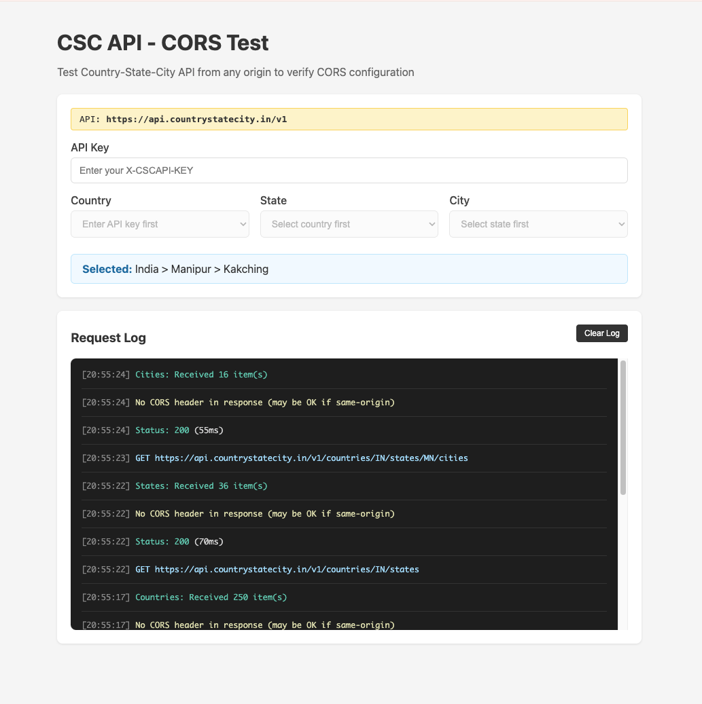

# CSC API - CORS Test

Test the [Country-State-City API](https://test.countrystatecity.in/) from any origin to verify CORS configuration.

## Features

- Enter your API key to authenticate requests
- Cascading dropdowns: Country → State → City
- Real-time request logging showing:
  - HTTP status and response time
  - CORS headers (`Access-Control-Allow-Origin`)
  - Cache status (`X-Cache`)
  - Error diagnostics for CORS failures

## Usage

1. Get an API key from [countrystatecity.in](https://countrystatecity.in/)
2. Open the test page
3. Enter your `X-CSCAPI-KEY`
4. Select a country, state, and city
5. Monitor the request log for CORS headers and responses

## Live Demo

Visit [test-csc-api.darshan.dev](https://test.countrystatecity.in) (or your configured domain)

## API Reference

- [API Documentation](https://docs.countrystatecity.in/)
